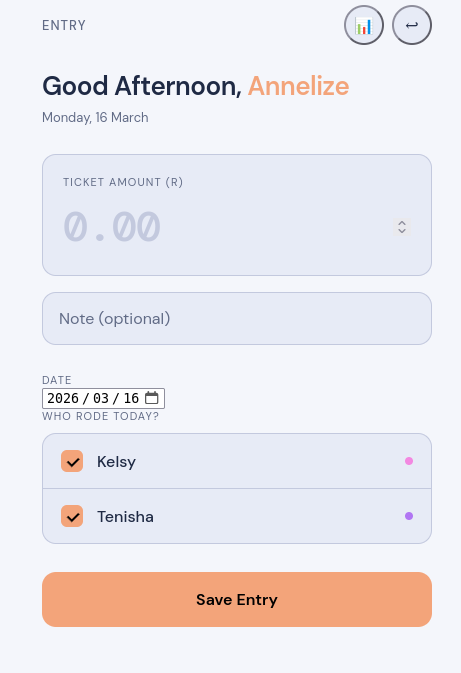
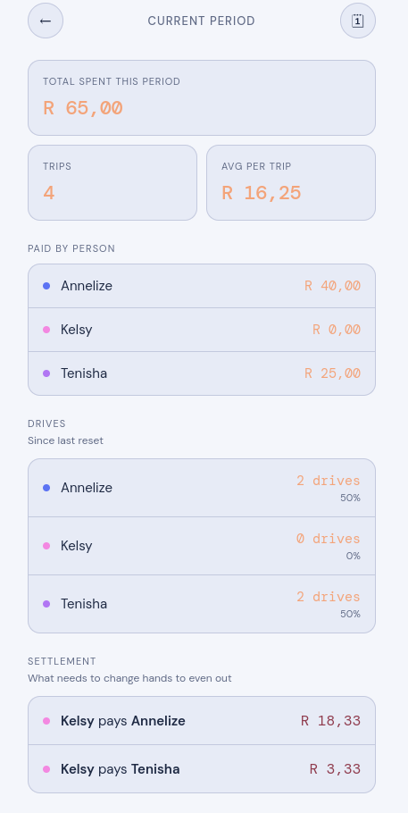
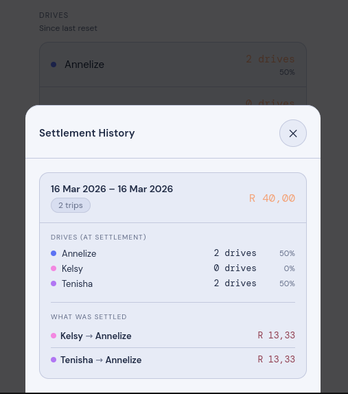

# Saamry

A private PWA for small carpool groups to track daily parking ticket costs and settle up fairly — without spreadsheets or mental math.

Built for 3 people. One person pays for parking each day, logs the amount, and checks off who rode. The app tracks who owes who across the entire period and calculates the minimum payments needed to settle up. All data lives in your own Supabase project.


---

## Features

- **Daily trip logging** — amount, optional note, date picker (for missed entries), and per-person ridership
- **Running totals** — debt and drive counts accumulate across months, not just calendar periods
- **Settlement flow** — initiate a money settlement, all 3 members must confirm before balances reset
- **Drive reset** — reset drive counts independently of debt, no confirmation required
- **Settlement history** — each completed period is saved as a card with total spent, drives at settlement, and what was owed
- **No-password login** — tap your name to sign in
- **PWA** — installs to home screen on iOS and Android, works offline for cached assets
- **Dark UI** — black background, blue-tinted surfaces, yellow-green accent

---

## Screenshots

| Login | Entry | Charts | History |
|---|---|---| --- |
|  |  |  |  |

---

## Tech stack

| Layer | Choice |
|---|---|
| Frontend | Vanilla HTML, CSS, JS — no framework |
| Database | [Supabase](https://supabase.com) (PostgreSQL + Auth + RLS) |
| Hosting | [Netlify](https://netlify.com) (free tier, drag-and-drop deploy) |
| App packaging | PWA — manifest + service worker |

---

## File structure

```
saamry/
├── index.html               ← All 3 screens (login, entry, charts)
├── manifest.json            ← PWA config — update URL after deploying
├── sw.js                    ← Service worker (offline + install)
├── supabase_setup.sql       ← Run once in Supabase SQL editor
├── css/
│   └── style.css
├── icons/
│   ├── icon-192.png
│   └── icon-512.png
└── js/
    ├── config.js            ← ⚠ Edit this first
    ├── auth.js              ← Login / session / profile
    ├── db.js                ← All DB queries + settlement logic
    └── app.js               ← UI + screen routing
```

---

## How the math works

For each trip the ticket cost is split equally among everyone who rode that day. The driver is always included. If someone didn't ride, they owe nothing for that trip.

```
Example: R60 ticket, Alice drove, Bob rode, Carol stayed home

  Alice paid R60   → credited +R60
  Alice rode       → debited  −R30  (R60 ÷ 2 riders)
  Bob rode         → debited  −R30

  Net: Alice +R30, Bob −R30, Carol R0
  → Bob pays Alice R30
```

Balances accumulate across all unsettled trips. When the group settles up, the app calculates the minimum number of payments to clear all debts — typically just 1 or 2 transactions.

---

## Settlement flow

1. Any member taps **Settle Up → Settle Money**
2. A pending banner appears on the charts screen for all users
3. The banner shows who has confirmed and who hasn't
4. Once all 3 confirm, balances reset to zero and the period is saved to history
5. Any member can tap **Cancel for Everyone** to abort before it completes

Drive counts are tracked separately and reset independently via **Settle Up → Reset Drives**. Resetting drives requires no confirmation. When a money settlement completes, the current drive counts are snapshotted into history before they continue accumulating.

---

## Database schema

```
profiles                   — one row per user (id, name)
trips                      — one row per parking day (date, paid_by, amount, note, settlement_id)
trip_riders                — junction: who was in the car each trip
settlements                — one row per money settlement (pending or complete)
settlement_confirmations   — who has confirmed a pending settlement
settlement_drive_snapshot  — drive counts captured at moment of settlement
app_state                  — key/value store (drives_reset_at timestamp)
```

All tables have RLS enabled. Every logged-in user can read all data (required for settlement calculations). Users can only insert their own trips.

---

## License

MIT — see [LICENSE](LICENSE) for full text.
